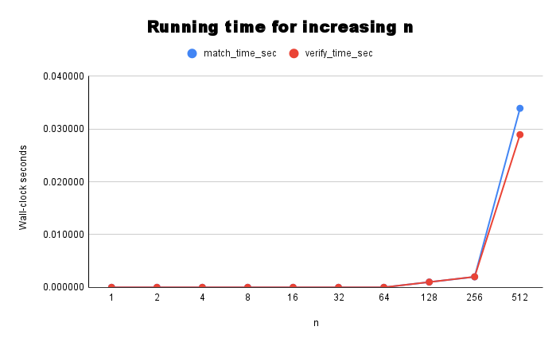

# Programming Assignment 1: Matching and Verifying
Gale-Shapley-Algorithm for COP4533 Programming Assignment 1

## Team Members
- **Semyon baykov:** 
  **65667853**  

- **Evan Harden:** 
  **27541192**  
  
## To compile/build the code and run Tasks A, B, and C
Python is required to run the program. 
To run, first **cd src** and use:

    python main.py <input_file>        (Tasks A + B + C)

    python main.py <input_file> --A    (Task A only)

    python main.py <input_file> --B    (Task B only)

    python main.py --C                 (Task C only)
  
  
Example for running the matcher and verifier on "example.in":

    python main.py example.in --B
  
For reference, the structure of our submission is:

├── README.md

├── task_c/

│   └── task_c_runtime_graph.png

│	└── output_c.out

└── src/

.    ├── main.py

.   └── example.in	<- input file you'd run the program with
  
## Assumptions
- Input files are well-formed and are always given with proper formatting as described on Canvas.
- Preference lists are complete and contain strict rankings.
- Hospitals and students are labeled from 1 to n.
- Timing measurements are taken using Python’s time.time() and represent wall-clock seconds.

## Task C graph and analysis

To evaluate scalability, we measured the running time of both the matching algorithm (Task A) and the verifier (Task B) for increasing problem sizes: n = 1, 2, 4, 8, 16, 32, 64, 128, 256, 512

For each value of n, we generated random complete preference lists for hospitals and students and measured the wall-clock running time (in seconds) using Python’s time.time() function. The matching algorithm and verifier were timed separately.
The trends that we noticed are:
- For small values of n, runtimes are near zero, probably due to how well the Python time module can resolve time.
- As n increases, both the matching and verification runtimes increase superlinearly.
- The matching algorithm consistently takes slightly longer than verification for larger n.
- At n=512, the runtime increases sharply compared to previous sizes, indicating non-linear growth.
- In our implementation, preference comparisons use Python’s list.index(), which is O(n), which means our runtime is closer to O(n^3).
- The verifier checks for blocking pairs and therefore runs in approximately O(n^2) time.
